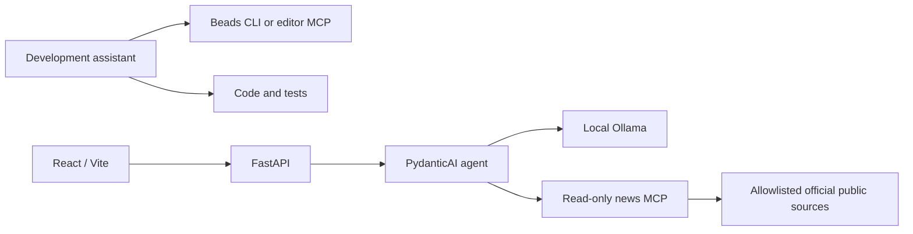

# Proposed Application Architecture

Status: workshop baseline for human approval; no runtime exists yet.

The two environments do not share tool registries. The application cannot access
Beads, shell execution, code edits, or repository writes. Editor skill files do not
automatically become runtime instructions.

## Decisions

- Python/FastAPI for APIs and lifecycle management; React/TypeScript/Vite for the UI.
- PydanticAI for a bounded single agent with typed output and MCP integration.
- Ollama Qwen3 4B via explicit localhost endpoint, without hosted telemetry or cloud fallback.
- Python FastMCP over local stdio for one read-only `fetch_latest_updates` tool.
- In-memory cache initially; no application database or vector store today.
- CLI-first canonical Beads operator; editor MCP is optional and separate from runtime.

Check installed-version SDK APIs before writing code. Current researched PydanticAI docs
describe `OllamaModel`, `OllamaProvider`, and `MCPToolset`; older examples may differ.
Log stdio MCP diagnostics to stderr, not protocol stdout.

## Proposed Contracts

| Record | Fields |
| --- | --- |
| RawUpdate | id, publisher, original_title, source_url, published_at (nullable), fetched_at, excerpt, content_scope, mode |
| DigestItem | raw_update_id, headline, what_changed, why_it_matters, caveat (optional) |
| DigestResponse | items, checked_at, mode, source_status, stale, generation_status |

The model returns known source IDs, not invented URLs or dates. Backend code joins publisher,
URL, and date from source records and rejects unknown or duplicate IDs. Interpretive
why-it-matters text must not be presented as a publisher's factual claim.

## Proposed API and Limits

- `GET /health`: backend/model readiness without forcing inference.
- `GET /api/news`: cached digest or explicit empty/degraded state.
- `POST /api/refresh`: one serialized bounded refresh; no arbitrary user URL/prompt execution.
- Up to five digest cards; begin inference with three source candidates.
- Source timeout: 10 seconds; overall local run deadline: 90 seconds.
- Initial model request budget: three calls with at most one validation retry within that budget.
- Digest cache TTL: 15 minutes; label cached data stale when a refresh fails.

These are starting budgets to test, not measured performance guarantees.
If model-selected tool use fails, a deterministic MCP-fetch/local-summary workflow can
serve as a disclosed fallback; it does not prove autonomous tool calling worked.

## Data and UX Safety

- Default to genuinely dated items from the last seven days, newest first; no publisher quotas.
- Preserve missing dates as unknown; never invent freshness or silently widen the date interval.
- Parse feeds/HTML with libraries, canonicalize URLs with structured URL APIs, and deduplicate.
- Fetch only approved public HTTPS destinations; validate redirects and block private targets.
- Treat source text as untrusted data; escape rendered content and enforce capability boundaries.
- Preserve source excerpts and content scope. Do not pretend an excerpt is the whole article.
- Use finite readable cards, expandable details, source links, and keyboard/mobile access.
- Show loading, empty, unavailable, stale, and fixture states clearly.

## Verification and Deferred Work

Automated checks use fixtures/model stubs. Live fetches, actual MCP tool calls, local inference,
and human factual review are separate evidence. Schema validity alone does not prove truth.

Public hosting requires an explicit local-model hosting/security decision, not an automatic
switch to a hosted model. Scheduling, persistence, authentication, and production rollback
are deferred. Record changed decisions using the [decision template](decisions/decision-template.md).