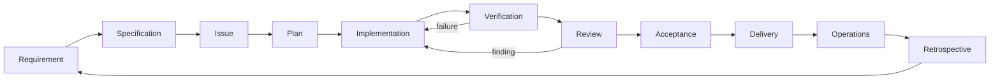

# Agentic Software Development Lifecycle

The application is a teaching vehicle. Agents assist each stage; humans remain
accountable for requirements, permissions, architecture, and acceptance.

## Stage Map

| Stage | Human responsibility | Agent contribution | Evidence |
| --- | --- | --- | --- |
| Requirements | Choose audience and outcome | Clarify ambiguity and exclusions | Approved goal |
| Specification | Approve acceptance criteria | Draft testable behaviors | [Feature specification](../specs/feature-template.md) |
| Tracking | Assign owner and blockers | Query and maintain authorized tasks | Beads issue ID and dependency graph |
| Planning | Approve scope and permissions | Read nearby code; propose a small change and check | Short plan |
| Implementation | Supervise file ownership | Implement the approved slice | Diff tied to issue |
| Verification | Assess adequacy of checks | Execute scoped tests and report failures | Actual commands/results |
| Review | Supply independent reviewer | Inspect diff and missing evidence | Findings and resolutions |
| Acceptance | Decide whether criteria are met | Summarize evidence and limitations | Named human decision |
| Delivery | Approve release or local demo | Document reproducible startup | Reproduction result |
| Operations | Decide failure/refresh policy | Inspect local logs and diagnose failure | Failure drill and recovery |
| Retrospective | Prioritize next learning | Suggest one evidenced workflow improvement | Learning and follow-up issues |

## Customization Primitives

- [AGENTS.md](../AGENTS.md): shared, always-applicable project conventions.
- [Copilot instructions](../.github/copilot-instructions.md): editor entry point.
- Skills: reusable procedures loaded on demand, not application runtime prompts.
- Agents: focused roles with explicit tool permissions; planner/reviewer are read-only.
- Prompts: a single reusable request, such as planning a task or reflecting on evidence.
- MCP: a protocol for exposing tools/data. Configuration alone does not prove connection.
- Hooks/CI: deterministic enforcement; add executable gates once real checks exist.

## Exercise

1. Use `/start-task` to plan a source adapter with acceptance criteria.
2. Have the canonical tracker operator create and claim its Beads issue.
3. Invoke the relevant source skill and approve the plan before code changes.
4. Implement one small slice, run its focused test, and record the result.
5. Give the independent reviewer the diff and actual evidence.
6. Obtain human acceptance, reproduce the demo, then close the issue.
7. Use `/retrospective` to identify an improvement based on observed behavior.

## Completion Is Not a Claim

Tests must fail when meaningful defects are introduced, not merely run without assertions.
Structured output validates shape, not truth. A separate review context reduces author bias,
but does not replace human acceptance. Source text cannot authorize tool execution.

Today covers a local delivery and failure drill. A complete production lifecycle also needs
deployment, access control, scheduled operation, monitoring, rollback, and ongoing evaluation.
Those are follow-up tasks, not implied capabilities of this scaffold.